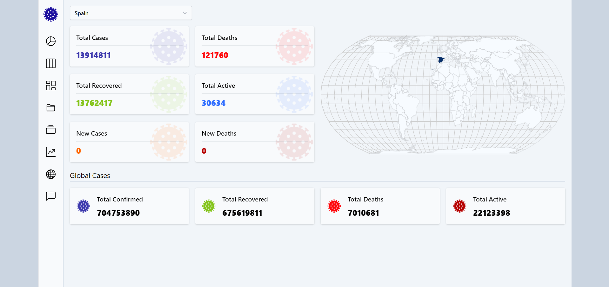

<!-- Improved compatibility of back to top link: See: https://github.com/othneildrew/Best-README-Template/pull/73 -->
<a name="readme-top"></a>
<!--
*** Thanks for checking out the Best-README-Template. If you have a suggestion
*** that would make this better, please fork the repo and create a pull request
*** or simply open an issue with the tag "enhancement".
*** Don't forget to give the project a star!
*** Thanks again! Now go create something AMAZING! :D
-->


<!-- PROJECT SHIELDS -->
<!--
*** I'm using markdown "reference style" links for readability.
*** Reference links are enclosed in brackets [ ] instead of parentheses ( ).
*** See the bottom of this document for the declaration of the reference variables
*** for contributors-url, forks-url, etc. This is an optional, concise syntax you may use.
*** https://www.markdownguide.org/basic-syntax/#reference-style-links
-->

<!-- PROJECT LOGO -->
<br />
<div align="center">

  <h3 align="center">Covi Map</h3>

  <p align="center">
    Infórmate de los casos de COVID en tiempo real
  </p>
</div>


<!-- ABOUT THE PROJECT -->
## Sobre el proyecto

  <a href="">
    
  </a>

Con esta web podrás informarte de los casos de COVID en tiempo real, tanto de países de forma individual, global e incluso saber cuáles son los países más afectados por esta enfermedad.

También dispone de un pequeño formulario de contacto.

<p align="right">(<a href="#readme-top">back to top</a>)</p>


### Herramientas utilizadas

En esta sección expondré los frameworks, librerías y herramientas utilizadas:

* Angular 17
* TypeScript
* Tailwind
* RxJS
* CSS
* HTML

API consumida:
<a href="https://disease.sh/docs/#/" >https://disease.sh/docs/#/</a>

<p align="right">(<a href="#readme-top">back to top</a>)</p>


<!-- GETTING STARTED -->
## Inicializando el proyecto

Sigue los siguientes pasos para inicializar el proyecto en local:

Instala las decependencias de NPM:
   ```sh
   npm install
   ```

Levantar servidor en local:
   ```sh
   npm start
   ```

<p align="right">(<a href="#readme-top">back to top</a>)</p>

